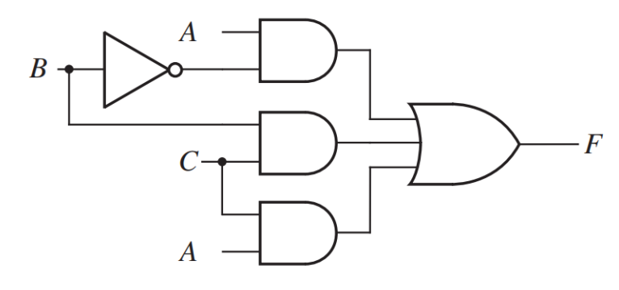

# Midterm Question

1. Dengan menggunakan metode **dataflow modeling**, buatlah code verilog yang merepresentasikan output dari F pada block diagram berikut. Tampilkan hasil pada RTL Viewer, buat testbench dengan variasi input dan jalankan simulasinya dengan Modelsim. Buatlah analisis dari hasil timing diagramnya!
    

        
    

2. Buatlah rangkaian Ripple Carry Adder (RCA) 8-bit dengan menggunakan full adder. Lakukan implementasi dengan Verilog pada Quartus, tampilkan hasil pada RTL Viewer Buat testbench dengan variasi input dan jalankan simulasinya dengan Modelsim. Berikan penjelasan mengenai kode dan hasil simulasi yang diperoleh.
   
3. Buatlah Finite State Machine (FSM) untuk mendeteksi adanya sekuens “0 1 1 0” (silakan memilih untuk menggunakan Moore ataupun Mealy). Gambarkan State Diagram dan State Table. Lakukan implementasi dengan Verilog pada Quartus, tampilkan hasil pada RTL Viewer dan State Machine Viewer. Buat testbench dengan variasi input dan jalankan simulasinya dengan Modelsim. Berikan penjelasan mengenai kode dan hasil simulasi yang diperoleh.